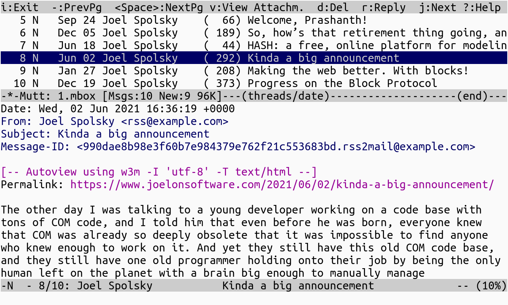

Convert an RSS/Atom feed into a collection of emails in mbox or rnews
formats.

* does NOT send emails
* sendmail ready
* auto deduces output to text/plain or text/html
* sanitized html
* no configs, settings, templates, &c
* smol

## Setup

Nodejs 20.x

    $ npm i -g rss2mail

## Usage

Read Spolsky's musings in mutt:

~~~
$ curl https://www.joelonsoftware.com/feed/ | rss2mail > 1.mbox
$ mutt -f 1.mbox
~~~

This will create html emails! You have no control around this--if
rss2mail detects plain text in feed articles then it produces
text/plain output.

To convert & send, install procmail pkg that contains [formail][] util:

    $ curl https://www.joelonsoftware.com/feed/ | rss2mail bob@example.com alice@example.net | formail -s sendmail -ti

To change `From` header, use

    $ curl ... | rss2mail -f me@example.com

To post to some `rss.test` newsgroup:

    $ curl https://www.joelonsoftware.com/feed/ | rss2mail --rnews rss.test | sudo -u news rnews -N

## See also

[grepfeed](https://github.com/gromnitsky/grepfeed),
[gmakerss](https://github.com/gromnitsky/gmakerss)

## News

* 1.0.0 breaking changes:

    * `message-id` is generated differently.

## License

MIT

[formail]: https://manpages.debian.org/unstable/procmail/formail.1.en.html
